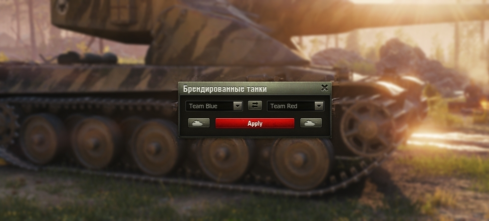
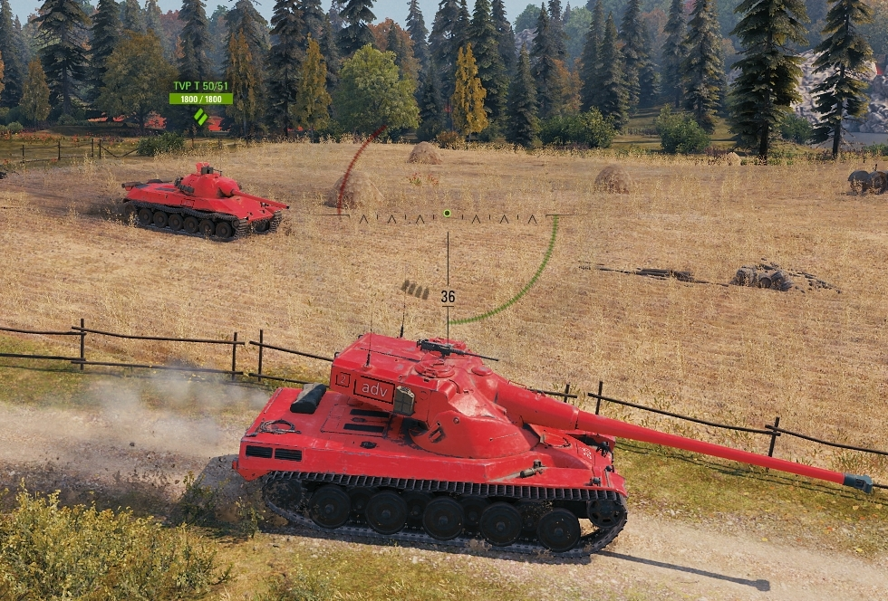

# Branded Tank Styles - World of Tanks Mod

## 🔍 Overview

**Branded Tank Styles** is a modification for **World of Tanks** that provides GUI and functionality for quick changes of tank camouflage, logos, and advertisements in the hangar for two teams. This mod allows players to customize their tanks for a more personalized experience.

## ✨ Features

- 🎨 **Quick Camouflage and Logo Changes**: Easily switch between different tank camouflages and logos in the hangar.
- 🛠️ **User-Friendly Interface**: Simple and intuitive interface for both players and operators.
- 📊 **Team Customization**: Apply different styles for both teams in the game.

## 📷 Screenshots

### Example of UI for player

### Example of UI for operator

### Example of tanks in battle

## ⚙️ Dependency
This project relies on the [Mods List](https://gitlab.com/wot-public-mods/mods-list) mod. Make sure to include this mod to ensure the proper functionality of **Branded Tank Styles**.

## 💡 How It Works

**Branded Tank Styles** allows you to quickly change the appearance of your tanks in the hangar. You can customize the camouflage, logos, and advertisements for both teams, making the game more visually appealing and personalized.

## 💖 Donate

If you enjoy **Branded Tank Styles** and would like to support its development, consider making a donation. Your contributions help improve the mod and keep it updated!

- **Support on Patreon**: [Patreon Link](https://www.patreon.com/poliroid)
- **Directly donate**: [Donation Methods](https://poliroid.me/donate/)

Thank you for your support!

## 📜 License

This project is licensed under the MIT License - see the [LICENSE](./LICENSE.md) file for details.

## 🤝 Contributing

Feel free to contribute to the project by submitting issues or pull requests! We welcome all forms of feedback and contributions from the World of Tanks community.

---

Enjoying Branded Tank Styles? Consider supporting us by sharing this mod with other players!
